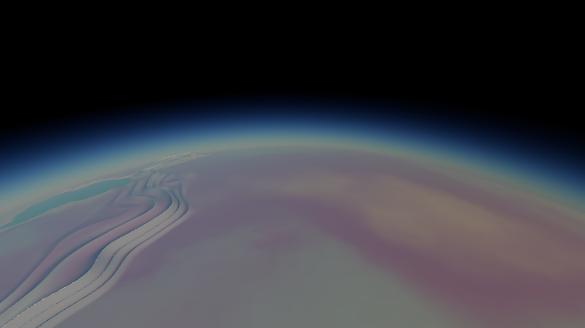
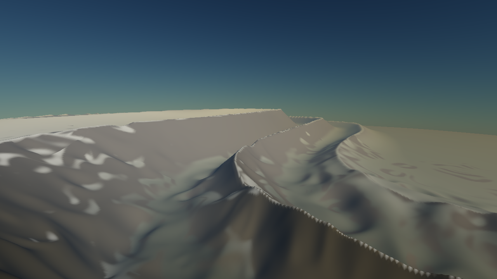
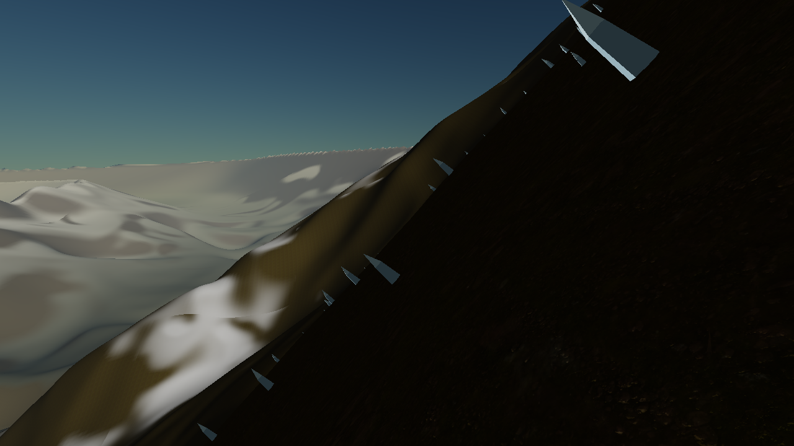
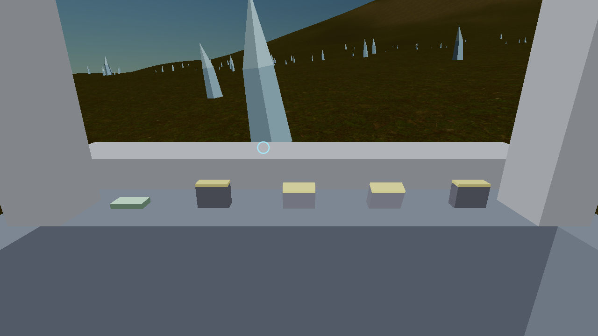

*[English](README.md) · Deutsch*

# Gaia — ein Planet in C++17 und Vulkan, von Hand

Ein Planet in Star-Citizen-Maßstab: **1000 km Radius, eine Welteinheit = ein
Meter**, durchgehend befliegbar vom Orbit bis auf **Submeter-Bodendetail**
(LOD-Tiefe 18, ~0,48 m Zellen), ohne Ladebildschirm. Kein UE5, kein Godot, keine
Engine — C++17, Vulkan 1.1, eigenes Fenster, eigene Mathematik, eigener
Bildlader, eigener Font-Atlas.

Ich baue das, weil ich wissen will, wie es *wirklich* funktioniert. Eine Engine
hätte mir jedes Problem in diesem README abgenommen — und damit auch alles, was
ich dabei gelernt habe.



| | |
|---|---|
|  |  |
|  | |

---

## Was schon da ist

**Gelände.** Würfelkugel mit Quadtree-LOD pro Fläche, Frustum-Culling,
Geomorphing. Das Höhenfeld ist zweibandig: ein Kontinentalband mit fest 8
Oktaven (LOD-invariant, damit die Küstenlinie sich nie bewegt) plus ein
Detailband, dessen Oktavzahl mit dem LOD wächst — über ein präfixsicheres fBm
mit **festem** Normalisierer, damit eine zusätzliche Oktave die vorhandenen
nicht umskaliert.

Gemessen: Landhöhe p50 537 m, p90 1485 m, max 6478 m. Lokales Relief über 2 km
Radius p50 261 m, p90 1030 m, max 3619 m (zum Vergleich: Alpen ~800 m, Himalaya
~1500 m). Neigung p50 6,8°, p90 27,0°.

**Plattentektonik statt Rauschen für die Wahrzeichen.** 10 Fibonacci-verteilte,
per Seed verwackelte Plattenkeime; `plateAt` ist eine lineare Suche über zehn
Skalarprodukte und liefert die nächste und zweitnächste Platte. Von ~24 Grenzen
tragen **4** ein Gebirge, ausgewählt nach ihrer **Landlänge** — nicht per Hash,
denn per Hash lag eine Kette vollständig und eine zu 93 % im Meer.

Jede Kette ist ein **Gürtel** aus 1–3 parallelen Graten mit Längstälern
dazwischen, 62–118 km breit, 1101–1287 km lang. Alle Eigenschaften kommen aus
einem Hash der Grenzidentität: Grathöhe, -breite, -schärfe, Asymmetrie,
Terrassierung, Gratzahl, Gratabstand, Vorzeichen (ein Viertel der Ketten sind
Grabenbrüche statt Gebirge). Die beiden ähnlichsten Ketten unterscheiden sich
noch um 0,57 in ihrer stärksten Dimension — und zwar nur auf Achsen, die auch
gerendert werden.

Die Grenze wird **domain-gewarpt**: nicht der Abstand zur Grenze, sondern die
Richtung *vor* der Partitionsabfrage. Tortuosität des Kamms 1,400 auf 1136 km
gelaufener Strecke, 88 km Abweichung vom Großkreis. Die Gürtel bedecken 5,1 %
des Landes.

**Materialien.** Sechs triplanar projizierte Bodentexturen in einem
Sampler-Array, gemischt über acht Vertex-Gewichte à ein Byte. Die Auswahl folgt
den **Klimazonen** (Höhe, Neigung, Breite, Feuchte) — dieselben vier Größen, die
auch die Palette benutzt, damit Materialgrenze und Farbgrenze dieselbe Linie
sind. Ein Klimaslot darf mehrere Texturen als **Varianten** führen, ausgewählt
über ein Kronendach-Feld; Texturen werden geteilt, eine Variante auf einer schon
geladenen Textur kostet also nichts.

**Atmosphäre.** HDR-Offscreen-Ziel, Composite-Pass mit Tonemapping,
Rayleigh-Streuung mit Luftperspektive, Sonnenscheibe. Reversed-Z mit unendlicher
Fernebene — bei 10⁹ m ist die Tiefe noch > 0.

**Schiff.** Flugmodell mit Flugassistent, Cockpit mit Schaltern, Fahrwerk,
Landung, Quantum-Antrieb zu sechs Außenposten. Die Landung ist ein Test: sie muss
auf allen vier Beinen aufsetzen, gemessen 4/4 bei 1,7° Neigung.

**Editor.** Im Kreativmodus ein Werkzeug-UI für alle Laufzeitparameter des
Planeten, mit Live-Neuaufbau. Planeten sind Textdateien; eine Tabelle speist
Editor, Schreiber und Leser, damit die drei nicht auseinanderlaufen. 16
Validierungsprüfungen weisen ungültige Parametersätze ab, statt sie zu zeichnen.

**Tests.** Ein kopfloses Testbinary mit **463 Zusicherungen**, das ohne Vulkan
läuft.

Bildraten ohne Validierungsschicht: 104–252 fps, alles über 60.

---

## Wie ich es gemacht habe

Das ist der Teil, der mir am meisten gebracht hat. Vier Regeln, alle durch
Schaden gelernt:

**1. Entscheidungen gehören in Vulkan-freie Header.** Alles, was das Gelände
bestimmt, steht in Headern ohne eine einzige Vulkan-Abhängigkeit. Deshalb kann
ein kopfloses Testbinary sie festnageln, und deshalb kann ich eine Behauptung
über den Planeten *messen* statt sie anzuschauen.

**2. Jede Schwelle sitzt auf einem gemessenen Quantil, nie auf dem, was auf einer
0..1-Skala sinnvoll aussieht.** Das ist die Regel, die ich am häufigsten verletzt
und am teuersten bezahlt habe. Ein fBm mit Gain 0,38 füllt [0,1] nicht — es
stapelt sich um die Mitte. Ein Band, das auf dem Papier vernünftig wirkt, gibt
einer Variante 99 % der Fläche und macht die andere unerreichbar. Der Test
druckt deshalb erst die Verteilung, dann setze ich die Konstante.

**3. Ein A/B ist erst ein Befund, wenn der Build bewiesen ist.** Siehe unten.

**4. Ein Test, der auf 8 Stichproben bestehen kann, misst nicht, was er
behauptet.** Drei meiner eigenen Tests waren so gebaut. Der Kammwanderungs-Test
lief 64 km auf einer 1287-km-Kette und erfüllte damit sein Tortuositätsband;
jetzt ist die gelaufene Länge Teil der Zusicherung. Der Einzigartigkeits-Test
zählte `peakRelief` als Unterscheidungsdimension — ein Feld, das das Gelände
**nie liest**. Und der Test, der die LOD-Kugel absichern sollte, prüfte sie gegen
dieselbe falsche Fläche wie der Code.

---

## Technische Schwierigkeiten

Die interessanten. Alle Zahlen sind gemessen, nicht geschätzt.

### Die enge LOD-Kugel umschloss eine Fläche, auf der kein Vertex liegt

Die Kugel, mit der das LOD den Abstand zu einem Patch misst, wurde aus
`terrainRadius` gebaut — und Detailband und Felstürme kommen erst danach obendrauf.
Jeder Vertex saß also um etwa die lokale Detailhöhe **außerhalb** seiner eigenen
Kugel. Weil die Split-Regel den Abstand als `|cam − Mitte| − surfaceRadius` misst
und das Geomorph-Band aus derselben Beziehung folgt, wurde ein Patch aufgegeben,
*bevor* seine Vertices fertig gemorpht waren: auf Ebene 17 kleinster
Morph-Faktor 0,0000 mit 0,27 m Restsprung.

Der Test, der genau das prüfen sollte, verglich ebenfalls gegen `terrainRadius`
— er bestand, während die Zusicherung verletzt war. Beide korrigiert:
Restschlupf jetzt 0,0 m bei 13×13-Abtastung, Morph auf allen Ebenen 1,0000.

Bloßer Zuschlag wäre hier falsch gewesen: 3 km auf eine 12-m-Kugel addiert macht
den Abstand ≈ 0 und unterteilt alles bis zur Maximaltiefe — das ist der
461 517-Blatt-Absturz, den der Dateikopf dokumentiert. Die echte Oberfläche
abzutasten verschiebt den **Mittelpunkt** mit, die Kugel bleibt eng.

### „Dünen-Wellen": der Knick in `ridge(n) = (1 − |n|)²`

Feine dunkle Fäden in geschlossenen Schleifen über flachem Gelände, überall.
Die Ableitung springt bei n = 0 von +2 auf −2 — ein echter Knick, und der ist
*Absicht*, er macht die Messergrate. Nur kreuzt das Rauschen überall die Null,
auch wo das Band fast keine Amplitude hat, und die Nulldurchgänge eines
Rauschfelds sind **geschlossene Schleifen**.

Der Beweis lief über zwei Schnitte: ohne jede gescannte Textur bleiben sie (also
Geometrie, nicht Material), mit abgeschalteter Ridge-Faltung verschwinden sie.
Dazwischen habe ich Terrassierung, Plateau-Terrassierung, Felstürme und das
Triplanar ausgeschlossen — alle unschuldig.

Behoben mit `sqrt(n² + ε²) − ε`, normiert damit `ridge(±1)` weiterhin exakt den
Talboden trifft. Der erste Versuch fiel durch: die Glättung **beiden**
Verbrauchern zu geben schob die Relief-Höhen-Korrelation von 0,155 auf 0,204
gegen eine 0,20-Schranke, weil die Verteilung der Faltung die Reliefquantile
setzt. Getrennt — scharf für das Reliefeld, weich für das Höhenband — liegt sie
bei 0,106.

### Warum man den Eingang eines hochfrequenten Feldes nicht örtlich verzerrt

Ich wollte Rippen, die die Bergflanke hinunterlaufen, und habe dafür das
Detailband quer zum Gürtel gestaucht, eingeblendet mit der Kettenhöhe. Es gab
Rippen — und konzentrische Höhenlinien-Ringe über jedem Berg des Planeten.

Die Arithmetik sagt warum: das Detailband wird bei Basisfrequenz ~345 abgetastet,
eine Verschiebung von 0,33 im Eingang sind also **114 Rauschperioden**. Der
Streckfaktor variierte mit `|orogeny|`, dessen Niveaulinien parallel zum Grat
laufen — das Rauschen glitt um Dutzende Perioden entlang genau dieser Linien und
zeichnete sie. Jede örtlich variierende Verzerrung eines hochfrequenten Felds
tut das; nur eine konstante ist sicher, und die hat eine Naht am Gürtelrand.

### Ein Domain-Warp kann nicht reißen — aber er kann falten

Der erste Warp verschob den **Abstand** zur Plattengrenze um einen Skalar. Bei
0,5 Gratbreiten war die Kette noch ein Lineal, bei 1,3 zerfiel sie in eine
gepunktete Reihe von Buckeln: ein Abstandsversatz bewegt jeden Punkt des Kamms
einzeln und reißt ihn auseinander.

Auf dem **Eingang** angewendet bewegt sich das Feld zusammenhängend, die Kette
kann nicht mehr reißen. Aber sie kann sich falten. Tortuosität gegen
Warp-Frequenz bei Amplitude 0,20: 2,5 → 1,06 (Lineal), 6,0 → 1,60 (gut),
10,0 → **17,1**, 16,0 → die Kette zerfällt nach 144 km. Die letzten zwei sind
derselbe Fehler: ein Domain-Warp hört auf **injektiv** zu sein, sobald der
Verschiebungsgradient 1 erreicht, und dann hat eine Grenze mehrere Urbilder. Der
Test prüft deshalb ein **Band**; einseitig hätte er die 17,1 mit Bestnote
durchgelassen.

### Der Zenit-Sprung: `cos(π/2) = −4,4·10⁻⁸`

Die Kamerabasis wurde aus `right = cross(worldUp, forward)` gebaut. Zeigt
`forward` fast gerade nach oben, ist das Kreuzprodukt fast Null — und in float
ist `cos(π/2)` nicht 0, sondern −4,4·10⁻⁸. Der normalisierte Vektor zeigt dann in
eine beliebige Richtung und **springt um 180° für 10⁻⁴ Radiant Nick**. Gemessen:
180,0° (Euler) gegen 0,0198° (Quaternion). Behoben über Yaw/Pitch → Quaternion →
Basis.

Mein erster Test dafür war falsch: er behauptete NaN. Es gibt kein NaN, es gibt
Instabilität — der Test musste die Instabilität messen, nicht auf ein Symptom
prüfen, das nie auftritt.

### `IWICBitmapScaler` tauscht Rot und Blau

Der Formatwandler stand *vor* dem Skalierer in der WIC-Kette und wurde still
überstimmt. Bewiesen, indem ich den Skalierer übersprang: exakte Übereinstimmung
ohne, vertauschte Werte mit. Das hat auch alle Normalmaps beschädigt — R war
tatsächlich B, also die z-Komponente als x. Behoben durch die Reihenfolge
Frame → Skalierer → Wandler.

### Die Kachel, die sich nicht schließt

Der Patch-Ursprung wurde modulo 2 m gefaltet, während der Shader zusätzlich bei
23 m abtastete. 23 ist kein Vielfaches von 2, also sprang die Makroschicht an
**jeder** Patchgrenze. Behoben mit 24 m und Faltung modulo der Makrokachel; ein
`static_assert` prüft die Teilbarkeit und ich habe verifiziert, dass er bei 23
auslöst.

### Zwei Messfallen, die mich Stunden gekostet haben

`cmd //c "build.bat Release"` aus einer Bash-Shell schlägt fehl und gibt nur
*„'build.bat' is not recognized"* aus. In `grep -c "error C"` gepipet kommt 0
zurück — was genau wie ein sauberer Build aussieht. Drei A/B-Experimente
hintereinander kamen bytegleich zurück, jedes sah nach einem echten Befund über
den Renderer aus, und alle drei waren dasselbe unveränderte Binary. Aufgeflogen
ist es, als ich den Fragment-Shader auf reines Rot zwang und sich *immer noch*
nichts änderte.

Und `Set-Content -Encoding utf8` schreibt in Windows PowerShell 5.1 ein **BOM**.
C++ verträgt das, GLSL nicht: `#version` bricht, der Build meldet den Fehler und
trotzdem Erfolg für die Exe, und der Screenshot benutzt still die alte `.spv`.

Seitdem: bauen nur über PowerShell, `Build OK` verifizieren, bei Shader-Änderungen
den Zeitstempel der `.spv` prüfen — und wenn ein A/B bytegleich zurückkommt, es
**nicht** interpretieren, sondern erst den Build beweisen.

### Weitere, kurz

- **Schieberegler-Identität war ein lokales float.** Einen Regler zu ziehen zog
  jede Zeile darunter mit, was den Parametersatz ungültig machte, worauf der
  Planet den Neuaufbau verweigerte. Drei Symptome, eine Ursache.
- **UI-Farben ausgewaschen.** Die Swapchain ist `_SRGB`, display-authored Farben
  sind also gamma-kodiert. Mein eigener Kommentar behauptete, Dekodierung sei
  unnötig — er war falsch.
- **Mausrad zweimal verbraucht.** `consumeWheel()` löscht beim Lesen, der Editor
  bekam also immer Null.
- **Hängender Zeiger nach `init()`**, das die Welt ersetzte: halbierte die
  Dreieckszahl und kostete den Landetest ein Bein, ohne eine einzige Fehlermeldung.
- **`memcmp` auf einer Parameterstruktur.** Padding ist nicht garantiert
  initialisiert; ersetzt durch Feldvergleich mit `static_assert` auf die Größe.
- **Physik und Rendering auf verschiedenen Planeten.** Der Bodenabfrager baute
  sich seine eigene Standardwelt — das Schiff landete auf unsichtbarem Gelände.
- **Terrassierte Plateaus brachen den Geomorph.** Riser 0,10 bei Mischung 0,85
  erzeugt ~1,5 km hohe Wände, die das halbaufgelöste Elterngitter nicht auflösen
  kann. Bisektiert (Grabenbrüche allein grün, Plateaus allein rot), gelöst bei
  0,22/0,60.
- **Die Culling-Schranke für Gebirge war 1 km zu klein** (4000 m gegen Ketten bis
  5060 m). Ein Patch, dessen 5×5-Gitter den Grat verfehlt, konnte weggeschnitten
  werden, während man ihn sieht.

---

## Was noch kommt

**Vegetation über ein PCG-System.** Der Streuobjekt-Generator ist im Kern schon
einer: deterministisches Punktgitter auf der Würfelfläche, nahtkonsistent, Dichte
aus dem Gelände, Ausrichtung an der echten Oberflächennormale, Aufbau im
Hintergrund-Job. Was fehlt, in dieser Reihenfolge:

1. **Echtes Instancing.** Heute ein Draw-Call pro Objekt — gemessen 4,83 ms
   Command-Recording für 1580 Draws, bei 11,1 ms Budget. Die Zeit ist linear in
   der Instanzzahl, 30 000 Bäume wären ~100 ms nur fürs Aufzeichnen. Das ist
   keine Optimierung, sondern Voraussetzung.
2. **glTF-Loader** für Baummodelle.
3. **Auto-LOD beim Laden**: Kantenkollaps zu drei Stufen plus Billboard-Impostor,
   damit ich keine LODs mitliefern muss.
4. **Die PCG-Schicht**: Arten, Dichte aus dem Kronendach-Feld (steht schon),
   Ausschlussregeln zwischen den Schichten, Lichtungen.
5. **Reichweite** von 450 m auf Kilometer.

*Nanite ausdrücklich nicht.* Der Renderer hat null Compute-Pipelines, null
Indirect-Draws und keine Mesh-Shader — das wäre ein Neubau. Und für
alphagetestetes Laub ist es ohnehin das falsche Werkzeug.

**Gelände.**
- **Per-Oktave-Glättung der Ridge-Faltung.** Eine Konstante ist ein Kompromiss:
  scharf genug für Grate heißt scharf genug für Kratzer. Auf Landform-Skala
  scharf und auf Meter-Skala weich braucht unterschiedliche ε pro Oktave.
- **Schutthalden am Wandfuß.** Neigung p99 liegt bei 70,7°, Maximum 88,6° — die
  Felstürme treffen senkrecht auf flachen Boden. Eine echte Wand hat einen Fuß.
- **Segmentierte Ketten** (en échelon), überlappende Teilketten mit Pässen
  dazwischen.
- **Entwässerung.** Der wirkliche Grund, warum echtes Gelände echt aussieht.
  Richtig gemacht braucht das Abflussakkumulation über den ganzen Planeten.

**Rendering.**
- **Triplanar neu projizieren.** Auf **42 % der Kugel** trägt die zweite
  Projektion ≥15 % Gewicht, im Extremfall 50/50 — zwei versetzte Kopien derselben
  Textur. Ein höherer Mischexponent schrumpft die Fläche auf 5,9 %, aber der
  Worst Case bleibt bei 0,500: auf der 45°-Linie sind zwei Komponenten *gleich*
  groß, und jede Potenz lässt sie gleich groß. Die Lösung stößt auf zwei echte
  Hindernisse — eine oberflächenfolgende Projektion bricht die Modulo-Rechnung,
  die es nur wegen der float-Genauigkeit bei 10⁶ m gibt, und ein stetiges
  Tangentenfeld auf einer Kugel hat nach dem Satz vom Igel zwangsläufig eine
  Singularität.
- **Blattbudget mit Prioritätswarteschlange** statt des heutigen
  höhenabhängigen Split-Faktors. Der ist ein Stellvertreter: er verteilt das
  Budget danach, wie viel Planet im Bild ist, und funktioniert, aber die
  saubere Regel ist „unterteile den Patch mit dem größten Bildschirmfehler, bis
  das Budget aufgebraucht ist".
- **Wolken, Monde, ein Gasriese am Himmel.**

**Assets.** Zwei der sechs Bodenmaterialien sind noch generierte Platzhalter, und
mir fehlt ein heller Gras-/Moos-Scan — die Lichtungs-Variante ist deshalb
abgeschaltet, weil die einzig verfügbare Textur dafür sich wie Strandsand liest.
Das Mechanismus steht, es fehlt nur die Textur.

---

## Bauen

```
build.bat            :: Release -> build\Release\planet.exe
build.bat Debug      :: mit Vulkan-Validierung
build.bat Release run
```

Braucht Visual Studio mit MSVC und das Vulkan SDK. Die Pfade zu `vcvars64.bat`
und Ninja stehen oben in `build.bat`.

Tests:

```
build\Release\planet_tests.exe
```

Die Abnahmeläufe, die ich nach jeder Geländeänderung durchziehe:

```
build\Release\planet.exe --flight-test 6000 --validate
build\Release\planet.exe --travel-test 60000 --validate
build\Release\planet.exe --freecam --alt 3 --frames 300 --validate
build\Release\planet.exe --freecam --alt 60 --skim 400 --frames 600 --validate
build\Release\planet.exe --cockpit --look-down 24 --frames 200 --validate
build\Release\planet.exe --frames 600 --creative-at 200 --validate
```

Nützliche Flaggen zum Anschauen: `--spawn-range` parkt die Kamera auf einer
Gebirgskette, `--spawn-canopy` an einer Waldkante, `--spawn-spire` in einer
Turmprovinz — ohne die findet kein Screenshot je eines dieser Dinge, weil sie
zusammen nur wenige Prozent der Landfläche bedecken.

## Was nicht im Repo liegt

`src/textures/` (308 MB gescannte Bodenmaterialien) und `src/example/`
(Referenzbilder) sind fremde Assets und ausgeschlossen. Der Loader sucht
rekursiv unter `src/textures` und akzeptiert nur Ordner, die auch eine Basecolor
enthalten — die Struktur ist also frei wählbar, und **fehlende Materialien sind
kein Fehler**: der Renderer setzt generierte Platzhalter ein, damit die Welt
immer zeichnet. Die Startzeile druckt, welcher Ordner für welche Schicht
gefunden wurde.

`shots/` (Screenshots) ist ebenfalls ausgeschlossen.
